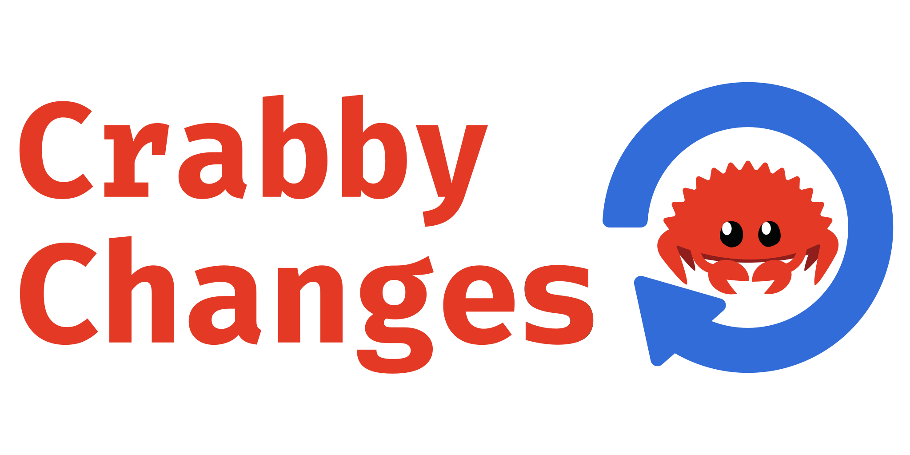

<br>

<br><br>

Crabby Changes is a changelog generator and release automation tool that gets out of your way.
It tries to automate **manually writing a changelog** as much as possible.
That may sound a bit contradictory but makes more sense once you look at existing solutions.
These generate a formatted changelog fully automatically by parsing commit messages/PR titles.
This approach not a good fit for some projects for a couple of reasons:

* Not every PR/commit needs a changelog entry
* A changelog entry might correspond to multiple PRs/commits
* A good commit message/PR for a developer is not necessarily a good changelog entry for a user
* Requires being very strict about commit messages/PRs during code review (loads of bikeshedding) to achieve a uniform style

Crabby Changes solves this problem by splitting changelog generation in two phases:

* converting a PR/commit into a change
* generating a pretty changelog from a list of changes

During the development phase the changelog is maintained as a toml file.
Changes inside this file look roughly like this:

``` toml
[[changes]]
message = "Fix a bug"
category = "Updates and fixes"
prs = [3849,2903]
```

This file can be edited by you at anytime, because crabby change **never overwrites** existing changes and only **adds** new changes.
When you want to actually create a release these changes are rendered using a [tera] template.

## Workflow

The idea behind crabby changes is that the `toml` changelog is maintained within a **separate `changelog` branch**.
Whenever a new PR is merged into the main branch crabby changes runs in CI and automatically appends a change to the toml file.
The PR title is used as the `message` and the `category` is determined from the PR labels.
If the PR description contains a line that starts with `changelog:` the remainder of the line will be used instead of the title.
You can edit this toml file at any point to improve the changelog as you wish.

> The following part of the workflow is not yet implemented

During the development phase crabby changes maintains a PR whose description contains a rendered version of the changelog.
Whenever you are ready to make a release you simply create a comment with the content `@crabby_changes release <VERSION>`
Crabby changes will automatically render the `toml` into a readable format, commit the changelog to the main branch and create a github release with the changes for this release.

[tera]: https://github.com/Keats/tera

## Status

Crabby changes is currently under active development and has not yet reached a stable release.
Expect breaking changes and bugs frequently.
A prebuilt linux binary can be [downloaded](https://openva.fra1.cdn.digitaloceanspaces.com/crabby_changelog) to experiment with crabby changes until then.

